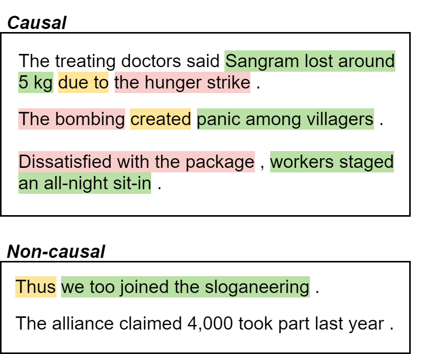

# Causal News Corpus


This repository contains the datasets and models for the Causal News Corpus (CNC). Our dataset is published in the LREC paper titled ["The Causal News Corpus: Annotating Causal Relations in Event Sentences from News"](https://aclanthology.org/2022.lrec-1.246/).

CNC works on two subtasks:

<b>[Subtask 1: Causal Event Classification](#subtask-1-causal-event-classification)</b> -- Does an event sentence contain any cause-effect meaning?<br>
<b>[Subtask 2: Cause-Effect-Signal Span Detection](#subtask-2-cause-effect-signal-span-detection)</b> -- Which consecutive spans correspond to cause, effect or signal per causal sentence? (Annotation in progress)

<br>

Causality is a core cognitive concept and appears in many natural language processing (NLP) works that aim to tackle inference and understanding. Generally, a causal relation is a semantic relationship between two arguments known as cause and effect, in which the occurrence of one (cause argument) causes the occurrence of the other (effect argument). The Figure below illustrates some sentences that are marked as <em>Causal</em> and <em>Non-causal</em> respectively.

|  | 
|:--:| 
| *Annotated examples from Causal News Corpus. Causes are in pink, Effects in green and Signals in yellow. Note that both Cause and Effect spans must be present within one and the same sentence for us to mark it as <em>Causal</em>.* |

### Shared Task

We are currently hosting a shared task, also known as the CASE-2022 Shared Task 3: Event Causality Identification with Causal News Corpus. The task is part of the [5th Workshop on Challenges and Applications of Automated Extraction of Socio-political Events from Text (CASE 2022)](https://emw.ku.edu.tr/case-2022/). All participating teams will be able to publish their system description paper in the workshop proceedings published by ACL.

Make your submissions at our [Codalab Page](https://codalab.lisn.upsaclay.fr/competitions/2299). Apply to participate via the [Participate tab](https://codalab.lisn.upsaclay.fr/competitions/2299#participate). Subsequently, email [tan.f@u.nus.edu](tan.f@u.nus.edu) with your (1) Name, (2) Codalab Username, (3) Instituition, and (4) Indicate which subtask you are keen to participate in. We will then approve your request and also add you into the mailing list for upcoming announcements. <b>We will only approve Codalab requests that contact us separately via email with the required information.</b>

<br>

# Subtask 1: Causal Event Classification

### Data:
Within the `data` folder, we provide the datasets:
* `train_subtask1.csv`: Train set (n=2925) with gold labels.
* `dev_subtask1_text.csv`: Development set (n=323) without gold labels.
* `CTB_forCASE.csv`: Processed [CausalTimeBank](https://hlt-nlp.fbk.eu/technologies/causal-timebank) dataset.
* `CTB_forCASE_rsampled.csv`: Processed CausalTimeBank dataset and sampled for balanced class labels.

The following datasets have been released for the Test Phase according to the shared task timeline:
* `dev_subtask1.csv`: Development set (n=323) with gold labels.
* `test_subtask1_text.csv`: Test set (n=311) without gold labels.

The following datasets were used in our experiments, but not released, due to copyright issues:
* `pdtb_mixed_resolved_forCASE_final`: Processed [PDTB V3.0](https://catalog.ldc.upenn.edu/LDC2019T05) dataset.

<b>Target column: `label`</b>

### Running BERT baseline:
Given a `<train.csv>` and `<val.csv>` file with columns `index`,`text`,`label` (`label` values should be in 0,1 int format), use our [`run_case.py`](run_case.py) script to train, evaluate and predict using `--do_train`, `--do_eval` and `--do_predict` flags respectively.

```
sudo python3 run_case.py \
--task_name cola --train_file <train.csv> --do_train \
--validation_file <val.csv> --do_eval \
--test_file <val.csv> --do_predict \
--num_train_epochs 10 --save_steps 50000 \
--per_device_train_batch_size 32 \
--per_device_eval_batch_size 32 \
--model_name_or_path bert-base-cased \
--output_dir outs --overwrite_output_dir
```

KFolds script is available in `kfolds.sh` which creates user-specified number of fold sets and runs the Train and Eval function over each fold. In our paper, we set K=5.

Further experiments are also available in `run_st1.sh` for reference. Within which, we also conducted experiments with the two external corpus (CTB and PDTB V3.0). More details are described in our paper.

This baseline corresponds to [Codalab submission](https://codalab.lisn.upsaclay.fr/competitions/2299#results) by "tanfiona". For LSTM baseline, submissions are by "hansih".

| # | User     | Date of Last Entry | Recall     | Precision  | F1         | Accuracy   | MCC        |
|:-:|----------|--------------------|------------|------------|------------|------------|------------|
| 1 | tanfiona | 03/23/22           | 0.8652 (1) | 0.8063 (1) | 0.8347 (1) | 0.8111 (1) | 0.6172 (1) |
| 2 | hansih   | 03/13/22           | 0.7303 (2) | 0.7514 (2) | 0.7407 (2) | 0.7183 (2) | 0.4326 (2) |

### Expected Output:
The model and parameters will be saved in the specified `--output_dir`. Alongwhich, `all_results.json` will reflect the metrics of the run. The Huggingface trainer will also automatically generate a model and results summary `README.md` file in the specified output folder.

<br>

# Subtask 2: Cause-Effect-Signal Span Detection
### Data:
Within the `data` folder, we provide the datasets:
* `train_subtask2.csv`: Train set (160 sentences, 183 relations) with gold labels.
* `train_subtask2_grouped.csv`: Train set (n=2925) with partial gold labels.
* `dev_subtask2_text.csv`: Development set (n=323) without gold labels.

The following datasets have been released for the Test Phase according to the shared task timeline:
* `dev_subtask2.csv`: Development set (15 sentences, 18 relations) with gold labels.
* `dev_subtask2_grouped.csv`: Development set (n=323) with partial gold labels.
* `test_subtask2_text.csv`: Test set (n=311) without gold labels.

To avoid revealing causal annotations for Subtask 1, we will be receiving span predictions on ALL sentences that tallies with the `_grouped` format. However, in evaluation, we only evaluate against the available annotated CAUSAL sentences. See [Subtask 2's evaluation folder](evaluation/subtask2) for more information.

<b>Target column: `causal_text_w_pairs`</b>

During final testing phase, both train and dev examples can be used to train your model. The data format will be exactly the same, so you can first design your models to train and test on currently available train and dev sets.

### Running Random baseline:
For Cause-Effect Span Detection, we only implemented a random generator shown under [`random_st2.py`](random_st2.py) to obtain predictions. This baseline corresponds to [Codalab submission](https://codalab.lisn.upsaclay.fr/competitions/2299#results) by "tanfiona".

| # | User     | Date of Last Entry | Recall     | Precision  | F1         | Accuracy  | MCC        |
|:-:|----------|--------------------|------------|------------|------------|-----------|------------|
| 1 | tanfiona | 06/08/22           | 0.0217     | 0.0217     | 0.0217     | 0.2084    | -          |

For a better starting model, we recommend partipants to adapt the token classification baseline model from [Huggingface's `run_ner_no_trainer.py` script](https://github.com/huggingface/transformers/blob/master/examples/pytorch/token-classification/run_ner_no_trainer.py). 

### Expected Output:
The predicted output will be saved in a JSON file as `outs/submission_random_st2.json`. Alongwhich, the evaluation metrics will be printed in the console.

<br>

# Cite Us
If you used this repository or our corpus, please do cite us as follows:

##### On Subtask 1:
```
@inproceedings{tan-etal-2022-causal,
    title = "The Causal News Corpus: Annotating Causal Relations in Event Sentences from News",
    author = {Tan, Fiona Anting  and
      H{\"u}rriyeto{\u{g}}lu, Ali  and
      Caselli, Tommaso  and
      Oostdijk, Nelleke  and
      Nomoto, Tadashi  and
      Hettiarachchi, Hansi  and
      Ameer, Iqra  and
      Uca, Onur  and
      Liza, Farhana Ferdousi  and
      Hu, Tiancheng},
    booktitle = "Proceedings of the Thirteenth Language Resources and Evaluation Conference",
    month = jun,
    year = "2022",
    address = "Marseille, France",
    publisher = "European Language Resources Association",
    url = "https://aclanthology.org/2022.lrec-1.246",
    pages = "2298--2310",
    abstract = "Despite the importance of understanding causality, corpora addressing causal relations are limited. There is a discrepancy between existing annotation guidelines of event causality and conventional causality corpora that focus more on linguistics. Many guidelines restrict themselves to include only explicit relations or clause-based arguments. Therefore, we propose an annotation schema for event causality that addresses these concerns. We annotated 3,559 event sentences from protest event news with labels on whether it contains causal relations or not. Our corpus is known as the Causal News Corpus (CNC). A neural network built upon a state-of-the-art pre-trained language model performed well with 81.20{\%} F1 score on test set, and 83.46{\%} in 5-folds cross-validation. CNC is transferable across two external corpora: CausalTimeBank (CTB) and Penn Discourse Treebank (PDTB). Leveraging each of these external datasets for training, we achieved up to approximately 64{\%} F1 on the CNC test set without additional fine-tuning. CNC also served as an effective training and pre-training dataset for the two external corpora. Lastly, we demonstrate the difficulty of our task to the layman in a crowd-sourced annotation exercise. Our annotated corpus is publicly available, providing a valuable resource for causal text mining researchers.",
}
```

##### On Both Subtasks:
```
@inproceedings{tan-etal-2022-event,
    title = "Event Causality Identification with Causal News Corpus - Shared Task 3, {CASE} 2022",
    author = {Tan, Fiona Anting  and  Hettiarachchi, Hansi  and  Hürriyetoğlu, Ali  and  Caselli, Tommaso  and  Uca, Onur  and  Liza, Farhana Ferdousi  and  Oostdijk, Nelleke},
    booktitle = "Proceedings of the 5th Workshop on Challenges and Applications of Automated Extraction of Socio-political Events from Text (CASE 2022)",
    month = dec,
    year = "2022",
    address = "Online",
    publisher = "Association for Computational Linguistics"
}
```

<br>

### Contact Us
* Fiona Anting Tan, tan.f[at]u.nus.edu
* Hansi Hettiarachchi, hansi.hettiarachchi[at]mail.bcu.ac.uk
