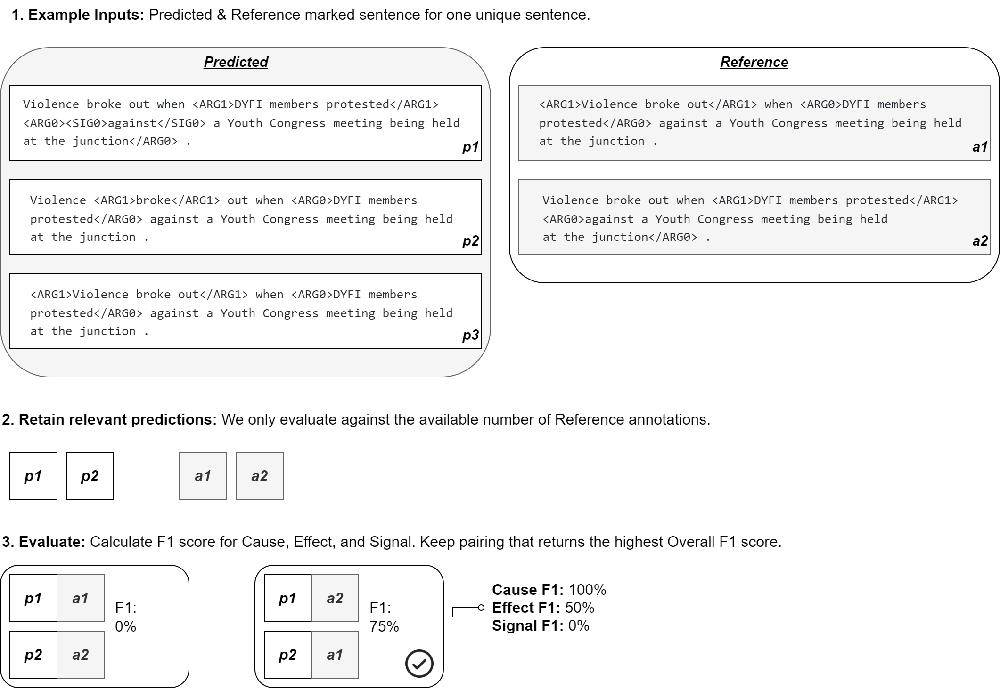

# CASE-2022 Event Causality Subtask 2 - Evaluation Script

## Submission instructions
The script takes one prediction file as the input. Your submission file must be a JSON file which is then zipped. We will only take the first file in the zip folder, so do not zip multiple files together.

```
{"index": 0, "prediction": ["<ARG0>Chale was allegedly chased</ARG0> <SIG0>by</SIG0> <ARG1>a group of about 30 people</ARG1> and was hacked to death with pangas , axes and spears ."]}
{"index": 1, "prediction": ["His attackers allegedly drank his blood ."]}
{"index": 2, "prediction": ["<ARG0>Dissatisfied with the package</ARG0> , <ARG1>workers staged an all-nigh sit-in</ARG1> ."]}
```

A sample file is available [here](sample/input/res/submission.json). The predictions corresponds to the target column `causal_text_w_pairs` in the reference file [here](sample/input/ref/truth.csv). 

❗Note1❗ Please ensure that the index order in the submission file is the same as the order in the original test data. You do not need to worry about the order of your predictions within this column. Our code will automatically extract the combination that results in the best F1 score, see illustration below.

❗Note2❗ We will only compare with the number of examples that the true label has. You need to sort and take into account the number of relations in your predictions, keeping in mind there are multi-relation examples. E.g:
* #predictions>#actual: If a sentence has 1 annotated relations, but you predicted 3 relations, we will only keep the first prediction.
* #predictions<#actual: If a sentence has 3 annotated relations, but you predicted 2 relations, we will assume all tokens are not-Cause/not-Effect/not-Signal for the missing prediction.


|  | 
|:--:| 
| *Infographic illustrating how we prcoess multi-relation examples for sequence evaluation.* |


We use [`seqeval`](https://huggingface.co/metrics/seqeval) evaluation metrics, corresponding to CoNLL NER tasks. For more information, refer to [seqeval GitHub page](https://github.com/chakki-works/seqeval).

<br>

## Testing the Script Offline
The evaluation script can run offline using the following command.
```
python _evaluate.py $input $output
```

The path to the input directory should be provided as the $input argument, and the path to the output directory should be provided as $output.

The input and output directories must match the Codalab format, as shown below. The input directory must contain two subdirectories:
'ref' with the reference ground truth dataset and 'res' with the results file. 
The output will be written to the 'scores.txt' in the output directory. 

```
input/
 |- ref/
     |- truth.csv
 |- res/
     |- submission.json
output/
 |- scores.txt
```
